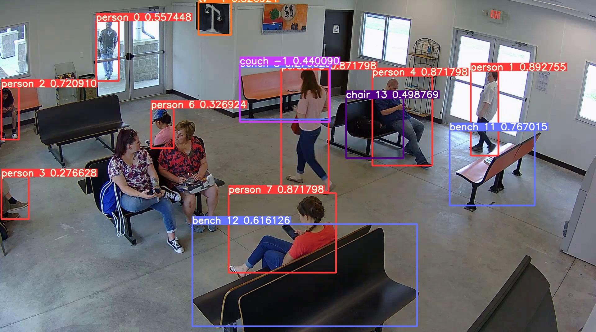

# yolov8-object-tracking
#### Implementation of Yolov8l tracking with tflite in C++


### Phase:
first experiments tracking algorithm in python
then converts it in C++
integerated with video and motion detection
do frame1, frame2, then use frame2 id to do frame2 and frame3
so for ssim, it is the matching algorithm between two images, may need to tune parameter when use
for seq, just got a new one called yolov8forseq, the yolov8forseq is for motion detection, so for that part
the motion detection should include when a new motion object is coming up and when a normal object is 
tracled as motion, also use the threshold way for motion detection.

use ssim and motion differently

the order i developed is yolov8_integer->tracking->ssim->motion->seg->integrate_all


### Features
- Object Tracks
- Different Color for every track
- Video/Image/WebCam/External Camera/IP Stream Supported

### Coming Soon
- Selection of specific class ID for tracking
- Development of dashboard for YOLOv8

### Steps to run Code

- Clone the repository
```
https://github.com/yide1235/Yolov8-tracking-tflite-CPP.git
```

### Results
Initial result using yolov8l quantized tflite pretrain model for stereo images(the first index is tracking id, the second is confidence, the color of the box is the class, you can notice this is two frame from a sequence):

https://github.com/yide1235/Yolov8-tracking-tensorflow-lite-CPP/assets/66981525/530f5db2-8c15-4bbe-bf1e-fc55c073045e
### Tracking on video and a pair of image



### Human parts segmentation, fine-tune yolov8 to pascal-part


### References
- https://github.com/abewley/sort
- https://github.com/ultralytics/ultralytics
- https://github.com/RizwanMunawar/yolov8-object-tracking.git


### C++run command figure out:
//help running command
//my part dont need tflite
//$ g++ -I../tensorflow -ltensorflow_cc -c test.cpp `pkg-config --cflags --libs opencv4`


//$ g++ -I../tensorflow -ltensorflow_cc -c test.o `pkg-config --cflags --libs 
opencv4`


### At this project, some linux error I met: 
error: /usr/lib/git-core/git-remote-https: symbol lookup error: /lib/x86_64-linux-gnu/libp11-kit.so.0: undefined symbol: ffi_type_pointer, version LIBFFI_BASE_7.0

solution: 
export LD_LIBRARY_PATH=/content/conda-env/lib:/usr/local/nvidia/lib:/usr/local/nvidia/lib64

//will work on the segmentation first
//hope it can be solved

//using original yolo repo:

(the last one should be int32, using that generate yolov8l and yolov8x to see the results)

(some env mayhelp: pip install torch==2.0.1

pip install torchaudio==2.0.2+cu118 torchdata==0.6.1 torchtext==0.15.2

pip install torchvision --upgrade

!pip install ultralytics)

yolo export model=yolov8l.pt data=coco128-seg.yaml format=tflite int32

yolo predict model=./yolov8x-seg_int8.tflite source='./download2.png'

-------

somecode: from ultralytics import YOLO

model_name = 'yolov8l-seg' #@param ["yolov8n-seg", "yolov8s-seg", "yolov8m-seg", "yolov8l-seg", "yolov8x-seg"]
input_width = 640 #@param {type:"slider", min:32, max:4096, step:32}
input_height = 640 #@param {type:"slider", min:32, max:4096, step:32}
optimize_cpu = False

model = YOLO(f"{model_name}.pt") 
model.export(format="tflite", imgsz=[input_height,input_width], optimize=optimize_cpu, int8=True)

//current converts pascal-part to yolo format

//doing the training today

//training cli: yolo task=segment mode=train model=yolov8l-seg.pt data=pascal-part-seg.yaml epochs=300 batch=8

//resume training cli example: !yolo task=segment mode=train resume model=./runs/segment/train6/weights/last.pt data=pascal-part-seg.yaml epochs=200 batch=12 


